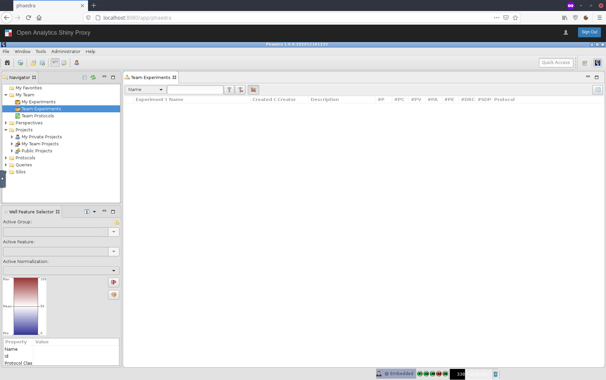
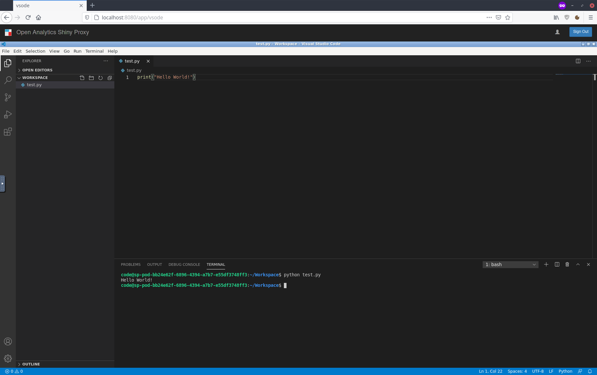

# ShinyProxy Desktop App Demo

[Screenshots](#screenshots)

This repository contains two demos of running desktop apps using ShinyProxy.
The first demo demonstrates running [Phaedra](https://phaedra.io) while the second demo show how to run Visual Studio Code.

We make extensively use of the great [https://github.com/fcwu/docker-ubuntu-vnc-desktop](docker-ubuntu-vnc-desktop) project.

## Building the Docker images

In order to build the Docker images, simply execute the `build.sh` script.
This script first builds two base images (one for Ubuntu 16.04 and one for 20.04).
Next, it builds `shinyproxy-desktop-app-demo:phaedra` and `shinyproxy-desktop-app-demo:vscode` containing the respective applications.
You can also simply down the images from [Docker Hub](https://hub.docker.com/r/openanalytics/shinyproxy-desktop-app-demo).

## ShinyProxy configuration

The following configuration is all what is needed to run these applications inside ShinyProxy:

```yaml
- id: phaedra
container-image: openanalytics/shinyproxy-desktop-app-demo:phaedra
port: 80
- id: vsode
container-image: openanalytics/shinyproxy-desktop-app-demo:vscode
port: 80
```

## How does this work?

The [https://github.com/fcwu/docker-ubuntu-vnc-desktop](docker-ubuntu-vnc-desktop) project is a Docker container which contains the following components:

- LXDE
- xvfb
- x11vnc
- noVNC
- nginx
- superverisor
- a web app to manage everything

The idea is to have an X server (xvfb), running a desktop environment (LXDE), this is exposed by VNC server (x11vnc) using a web app (nginx/python/vue/noVNC).
All these processes are managed by supervisor such that it fits in a single Docker container.

## Screenshots


